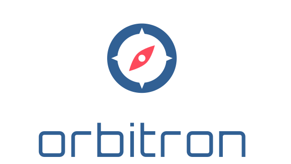

<p align="center">
        </image> <br />
        <h3 align="center"><i>A &ldquo;near me&rdquo; microservice for exposing your geocoded tabular data</i></h3>
</p>

<hr size="4" noshade="noshade" />

**Orbitron** is a microservice that you can deploy into your environment to expose a **location finder service** within your own applications.  The service can be deployed in minutes to a cloud provider with minimal dependencies.  A simple script is provided to help you upload your data to a PorgresSQL server instance.

## Usage

To perform a search against your endpoint, simply use the following fluent URL: `/nearest/{limit}/{source-name}/to/{zip-code}`.  This will perform a distance search against stored geocoded tabular data using functionality exposed through PostgreSQL.

## Example
A query for the nearest pharmacies: `/nearest/100/pharmacies/to/75001`

```javascript
{
        "name": "Mom & Pop's Local Pharmacy",
        "latitude": 33.435921,
        "longitude": -111.720686,
        ...
}
```

#### Custom Data Models
Additional data fields may be returned depending upon the contents of "rowdata" field in the database.  It may vary depending on the data source type, i.e. if the geopoint represents a store or office, it may be convenient to include a contact phone number, but for something like a national monument, it might be helpful to include a construction date or other historical details of interest.


<hr size="4" noshade="noshade" />

## Dependencies

This software requires access to a postgresql server with PostGIS 2.5.1 (or compatible version), with credentials set in a configuration file named ".env".  A `sample.env` file is included.

Building the postal code geodata also requires the file US.txt from geoname.org's free data at http://download.geonames.org/export/zip/ 

## Installation

Edit the file `sample.env` to reflect your postgresql credentials, and save the updated file as `.env` in the root folder of the project.

Place US.txt in the root folder and execute `python install.py` to perform initial database setup.

## Configuring Location Data

Your location data needs to be tied to a `sourceType` defined in the `Orbitron.Sources` table.  The `Name` field will correspond to the `{source-type}` parameter of the request URL.  The script `load.py` can be used to load the neighbor data, it takes a *csv* file as a parameter, i.e. `python load.py ./example.csv`.  The *csv* file should have columns in the following order:

```javascript
[ "SourceId", "Name", "Latitude", "Longitude", "RowData" ]
```

* `SourceId` is the appropriate Id of a source from the `Orbitron.Sources` table
* `Name` is the name of the location
* `Latitude` and `Longitude` are geocoordinates of each location
* `RowData` is any additional data that is to be associated with the record, formatted as a *JSON* string

For example, the *csv* file might be formatted as follows, and should not contain a header row:

```javascript
1,Test Location,42.872004,-87.952139,"{""phone"": ""555-555-5555""}"
```

#### Geocoding Your Dataset

If you do not have the *latitude* & *longitude* information for the locations in your dataset, but you do have address information, then you'll need to run the addresses through a geocoding service, such as https://www.geocod.io/.

## Running

Using `Python>=3.8`, install dependencies with `pip install -r requirements.txt`.  To start a development server, run `uvicorn main:app --reload`.

See [http://localhost:8000/docs](http://localhost:8000/docs) for auto-generated Swagger API documentation.

## Quick start using open pharamacy location data on local development server
1. Set up a postgresql instance with PostGIS

2. Perform installation as indicated in *"Installation"* section.

3. Download Rx Open's pharacy location database from https://rxopen.org/api/v1/map/download/facility and place the resulting `facility.csv` in the project's root folder.

4. Execute `python import-pharmacies.py`

5. Run development server, as indicated in *"Running"* section.

You should now be able to issue http requests using the API endpoints against the local server, such as `http://localhost:8000/nearest/100/pharmacies/to/75001`

## Running in Azure
This software can run in an Azure App Service with the custom startup command `python -m uvicorn main:app --host 0.0.0.0`

## Credits

A special thanks goes to [Matt McInerney](http://pixelspread.com/) for freely sharing his futuristic Orbitron font.

## License

This is an open source project licensed under MIT.
